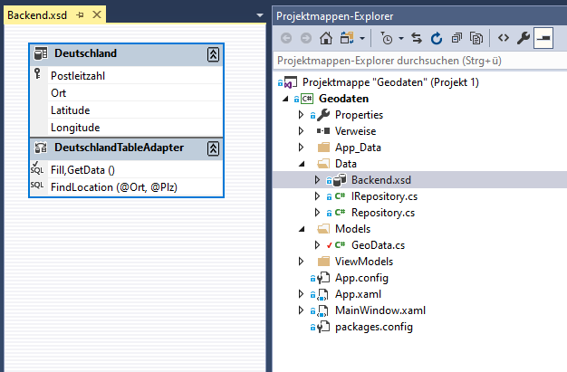
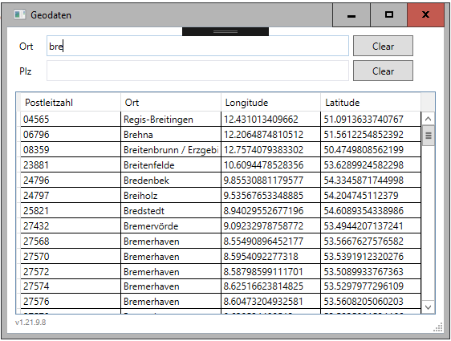

# DataRowConverter
DataRowConverter - a simple object mapper for DataTable

1. Ein DataSet dem Projekt hinzufügen (Beispiel Backend.xsd).
2. TableAdapteter hinzufügen und konfigurieren
3. Model erstellen
4. Repository erstellen



```csharp
namespace Geodaten.Models
{
    public class GeoData
    {
        public string Postleitzahl { get; set; }
        public string Ort { get; set; }
        public double? Longitude { get; set; }
        public double? Latitude { get; set; }
    }
}
```

```csharp
using System.Collections.Generic;
using System.Data;
using System.Linq;

namespace Geodaten.Data
{
    using Models;

    public class Repository: IRepository
    {
        public List<GeoData> FindLocation(string ort, string plz)
        {
            ort = (ort ?? string.Empty).Trim();
            plz = (plz ?? string.Empty).Trim();

            using (BackendTableAdapters.DeutschlandTableAdapter adapter = new BackendTableAdapters.DeutschlandTableAdapter())
            {
                return adapter.FindLocation(ort, plz).Select(DataRowConverter<GeoData>.Cast).ToList();
                //                                           ^----------------------------^
            }
        }
    }
}
```



