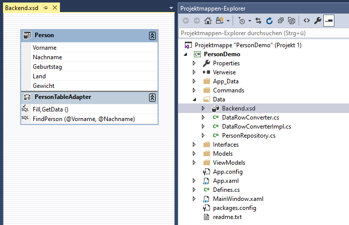

# DataRowConverter
DataRowConverter - a simple object mapper for DataTable

1. Ein DataSet dem Projekt hinzufügen (Beispiel Backend.xsd).
2. TableAdapteter hinzufügen und konfigurieren
3. Model erstellen
4. Repository erstellen



```csharp
namespace PersonDemo.Models
{
    public class Person
    {
        public string Vorname { get; set; }
        public string Nachname { get; set; }
        public DateTime? Geburtstag { get; set; }
        public string Land { get; set; }
        public double? Gewicht { get; set; }
    }
}
```

```csharp
using System.Collections.Generic;
using System.Data;
using System.Linq;

namespace PersonDemo.Data
{
    using Interfaces;
    using Models;

    public class PersonRepository : IPersonRepository
    {
        public List<Person> FindPerson(string vorname, string nachname)
        {
            using (BackendTableAdapters.PersonTableAdapter adapter = new BackendTableAdapters.PersonTableAdapter())
            {
                return adapter.FindPerson(vorname, nachname).Select(DataRowConverter<Person>.Cast).ToList();
            }
        }
    }
}
```


# Warum?
DataTable, DataSet, TableAdapter sind als Schicht für den Zugriff auf Daten nach wie vor eine gute Wahl.
Wer mit EF, Dapper, SQLPlus etc. arbeitet und damit klar kommt, alles super.

Für DataSet gibt es in Visual Studio einen guten Designer, wo man sich alles schön zusammenklicken kann.
Tutorials dazu gibt es im Internet genug. Ein großer Nachteil ist, dass es zu einer Zeit entstanden ist,
wo es noch keine Nullable Typen gab. Kurzum der Designer erstellt typisierte Klassen für DataTable und
DataRow (TypedTableBase etc.), die aber nicht so richtig mit null (DBNull) umgehen können.

Für die typisierte DataRow werden Methoden generiert, mit denen man das abfragen kann. Die entsprechende
Model-Instanz muss dann entsprechend erstellt werden. Das ist zwar umständlich aber was soll's.

```csharp
    return adapter.FindPerson(vorname, nachname).Select(row => new Person
    {
        Vorname = row.Vorname,
        Nachname = row.Nachname,
        Land = row.Land,
        Geburtstag = row.IsGeburtstagNull() ? (DateTime?)null : row.Geburtstag,
        Gewicht = row.IsGewichtNull() ? (double?)null : row.Gewicht
    }).ToList();
```

Normalerweise wird ein DataSet/DataTable, so wie EF auch, direkt verwendet und nicht in ein Repository gepackt.
Aus Gründen von IoC macht man das dennoch, zumal eine direkte Bindung in die UI hinein (WinForms, WPF) bei
Webanwendungen nicht gegeben ist, da möchte man das einfach getrennt haben.

Zusammengefaßt kann man sagen, DataSet ist noch gut, es schimmelt nicht, aber das OM ist veraltet.
Abhilfe schafft der DataRowConverter. Er kann die Daten aus der Datenbank, die über den TableAdapter gelesen werden,
einfach in eine Klasse übertragen.

```csharp
    return adapter.FindPerson(vorname, nachname).Select(DataRowConverter<Person>.Cast).ToList();
```

# Vorgehen
Der Konverter bekommt zwar eine typisierte DataRow (zB PersonRow), aber er nutzt nicht die generierten
Eigenschaften. Diese würden ja die nervige StrongTypingException("Der Wert für Spalte XYZ in Tabelle ABC ist DBNull")
werfen, wenn die Typen nicht mit null belegt werden können.

Der Konverter schaut sich die Eigenschaften der Model-Klasse an und merkt sich diese. Danach werden die Daten aus
DataRow gelesen, der Typ geprüft und einer neuen Model-Instanz zugewiesen. Der Konverter erkennt Nullable und kann
somit auch null zuweisen.

```csharp
namespace PersonDemo.Models
{
    public class Person
    {
        public string Vorname { get; set; }
        public string Nachname { get; set; }
        public DateTime? Geburtstag { get; set; }
        public string Land { get; set; }
        public double? Gewicht { get; set; }
    }
}
```

Für die Zuweisung muss der Name aus der Model-Klasse und der DataRow-Spalte übereinstimmen (case-insensitive).
Der Typ muss ebenfalls übereinstimmen, kann aber in der Model-Klass Nullable sein.

Ist die Eigenschaft nicht Nullable, so kann sie in der Model-Klasse mit einem Wert vorbelegt werden. Dieser
wird dann bei DBNull nicht überschrieben.

```csharp
namespace PersonDemo.Models
{
    public class Person
    {
        public string Vorname { get; set; }
        public string Nachname { get; set; }
        public DateTime? Geburtstag { get; set; }
        public string Land { get; set; }
        public double Gewicht { get; set; } = -1;
    }
}
```

Bei einem Konstruktor der eine DataRow akzepiert, wird lediglich dieser Konstrukor zu Initialisierung aufgerufen.
Die Daten müssen dann dort übertragen werden.

```csharp
namespace PersonDemo.Models
{
    public class Person
    {
        public Person(DataRow row)
        {
            // take values from row
        }

        public string Vorname { get; set; }
        public string Nachname { get; set; }
        public DateTime? Geburtstag { get; set; }
        public string Land { get; set; }
        public double? Gewicht { get; set; }
    }
}
```

Aktzepiert die Klasse die entsprechende typisierte DataRow, so wird dieser genutzt. 
Dieser Konstruktor hat die höhere Priorität.

```csharp
namespace PersonDemo.Models
{
    public class Person
    {
        public Person(Data.Backend.PersonRow row)
        {
            // take values from row
        }

        public string Vorname { get; set; }
        public string Nachname { get; set; }
        public DateTime? Geburtstag { get; set; }
        public string Land { get; set; }
        public double? Gewicht { get; set; }
    }
}
```
