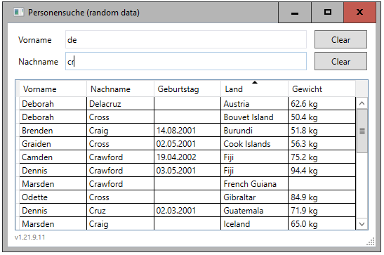

# DataRowConverter
DataRowConverter - a simple object mapper for DataTable

1. Ein DataSet dem Projekt hinzufügen (Beispiel Backend.xsd).
2. TableAdapteter hinzufügen und konfigurieren
3. Model erstellen
4. Repository erstellen


```csharp
namespace Geodaten.Models
{
    public class GeoData
    {
        public string Postleitzahl { get; set; }
        public string Ort { get; set; }
        public double? Longitude { get; set; }
        public double? Latitude { get; set; }
    }
}
```

```csharp
using System.Collections.Generic;
using System.Data;
using System.Linq;

namespace Geodaten.Data
{
    using Models;
    using Shared.Common.Data;

    public class Repository: IRepository
    {
        public List<GeoData> FindLocation(string ort, string plz)
        {
            using (BackendTableAdapters.DeutschlandTableAdapter adapter = new BackendTableAdapters.DeutschlandTableAdapter())
            {
                return adapter.FindLocation(ort, plz).Select(DataRowConverter<GeoData>.Cast).ToList();
            }
        }
    }
}
```



# Warum?
DataTable, DataSet, TableAdapter ... das ist doch so alt wie Window Forms, macht doch keiner mehr.
Alt ja, aber unterschätzt. Als Schicht für den Zugriff auf Daten ist es nach wie vor eine gute Wahl.
Wer mit EF, Dapper, SQLPlus etc. arbeitet und damit klar kommt, alles super.

Für DataSet gibt es in Visual Studio einen guten Designer, wo man sich alles schön zusammenklicken kann.
Tutorials dazu gibt es im Internet genug. Ein großer Nachteil ist, dass es zu einer Zeit entstanden ist,
wo es noch keine Nullable Typen gab. Kurzum der Designer erstellt typisierte Klassen für DataTable und
DataRow (TypedTableBase etc.), die aber nicht so richtig mit null (DBNull) umgehen können.

Für die typisierte DataRow werden Methoden generiert, mit denen man das abfragen kann. Die entsprechende
Model-Instanz muss dann entsprechend erstellt werden. Das ist zwar umständlich aber was soll's.

```csharp
    return adapter.FindLocation(ort, plz).Select(row => new GeoData
    {
        Ort = row.Ort,
        Postleitzahl = row.Postleitzahl,
        Latitude = (row.IsLatitudeNull() ? (double?)null : row.Latitude),
        Longitude = (row.IsLongitudeNull() ? (double?)null : row.Longitude)
    }).ToList();
```

Normalerweise wird ein DataSet/DataTable, so wie EF auch, direkt verwendet und nicht in ein Repository gepackt.
Aus Gründen von IoC macht man das dennoch, zumal eine direkte Bindung in die UI hinein (WinForms, WPF) bei
Webanwendungen nicht gegeben ist, da möchte man das einfach getrennt haben.

Zusammengefaßt kann man sagen, DataSet ist noch gut, es schimmelt nicht, aber das OM ist veraltet.
Abhilfe schafft der DataRowConverter. Er kann die Daten aus der Datenbank, die über den TableAdapter gelesen werden,
einfach in eine Klasse übertragen.

```csharp
    return adapter.FindLocation(ort, plz).Select(DataRowConverter<GeoData>.Cast).ToList();
```

# Was geht?
Der Konverter bekommt zwar eine typisierte DataRow (zB DeutschlandRow), aber er nutzt nicht die generierten
Eigenschaften. Diese würden ja die nervige StrongTypingException("Der Wert für Spalte XYZ in Tabelle ABC ist DBNull")
werfen, wenn die Typen nicht mit null belegt werden können.

Der Konverter schaut sich die Eigenschaften der Model-Klasse an und merkt sich diese. Danach werden die Daten aus
DataRow gelesen, der Typ geprüft und einer neuen Model-Instanz zugewiesen. Der Konverter erkennt Nullable und kann
somit auch null zuweisen.

```csharp
namespace Geodaten.Models
{
    public class GeoData
    {
        public string Postleitzahl { get; set; }
        public string Ort { get; set; }
        public double? Longitude { get; set; }
        public double? Latitude { get; set; }
    }
}
```

